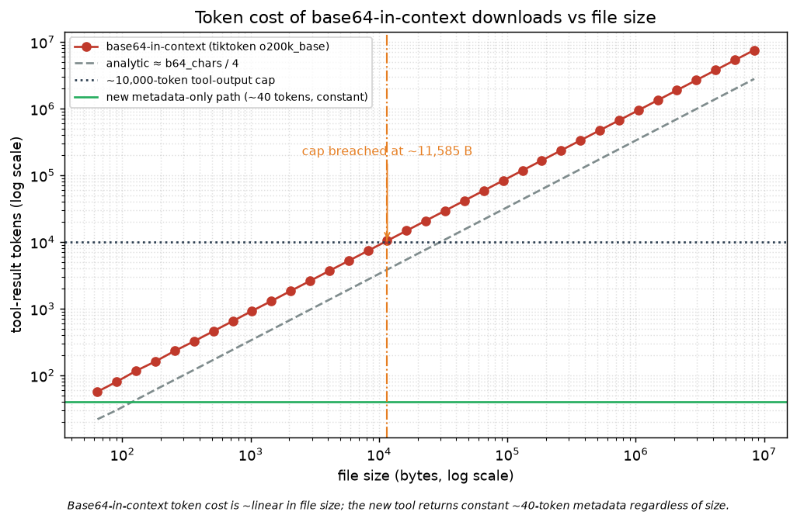
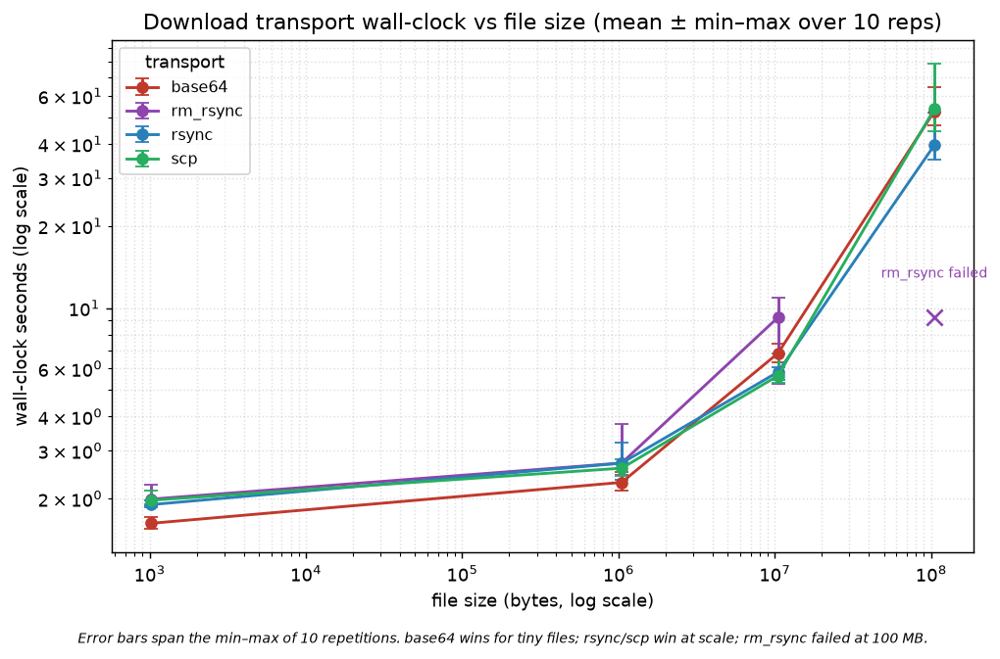

# fs_download transport benchmark — Findings (v0)

Date: 2026-07-02

---
type: findings
topic: fs-download-rework
date: 2026-07-02
version: v0
prior-version: none
key-metric: base64-in-context 10k-token-cap crossover: 11.6 KiB (prior: N/A, delta: N/A)
decision-required: confirm
---

## Headline Result

metric: file size at which base64-in-context breaches the ~10k-token tool-output cap
value: 11.6 KiB (measured, tiktoken o200k_base) — new metadata-only path is ~40 tokens at any size
unit: KiB
prior: N/A (first run)
direction: new

## Results Tables

### Wall-clock — mean over 10 reps (min / max), seconds

| size | base64 | rsync | scp | rm_rsync |
|---|---|---|---|---|
| 1 KB | **1.62** (1.54/1.72) | 1.90 (1.86/1.96) | 1.97 (1.90/2.14) | 1.99 (1.88/2.26) |
| 1 MB | **2.29** (2.14/2.50) | 2.70 (2.35/3.20) | 2.59 (2.43/2.79) | 2.70 (2.44/3.77) |
| 10 MB | 6.83 (6.34/7.43) | 5.83 (5.43/6.09) | **5.65** (5.30/6.82) | 9.25 (5.27/10.93) |
| 100 MB | 52.74 (46.9/64.6) | **39.61** (35.1/52.3) | 53.77 (44.5/79.2) | ✗ failed |

### Token / context cost (real tokenizer, o200k_base)

| file size | base64-in-context tokens | new metadata-only | over 10k cap? |
|---|---|---|---|
| 1 KB | ~0.9 K | ~40 | no |
| 11.6 KiB | ~10 K | ~40 | at threshold |
| 1 MB | ~945 K | ~40 | 94× over |
| 100 MB | ~94 M | ~40 | 9400× over |

Measured slope ≈ **0.90 tokens/byte** (~2.7× the naive `chars/4` estimate — high-entropy base64 barely merges in BPE).

## Observations

| Signal | Baseline / Expected | Observed [source] | Interpretation |
|---|---|---|---|
| Token cost @ 1 MB | IRI spec returns full base64 body | ~945 K tokens [token_scaling.csv] | 94× the tool cap → call fails outright; this is the reported production failure |
| Cap crossover | analytic estimate implied ~30 KB | 11.6 KiB [token_scaling.png] | real cost is worse; base64-in-context is unusable past ~12 KB |
| Large-file speed | base64 (old mechanism) 52.7 s @100 MB | rsync 39.6 s [benchmark.csv] | rsync ~25% faster at scale, + resume + checksum |
| Integrity | all transfers verify | 100% verified except rm_rsync@100 MB [benchmark.csv] | rm_rsync unreliable at scale (also slowest @10 MB) |
| >146 KB round-trip | old path silently truncates at 200 KB | verified=True via new path [smoke.py] | the silent-corruption bug is resolved |

## Charts & Visualizations



*Base64-in-context token cost is ~linear in file size (≈0.90 tok/byte); it crosses the ~10k-token tool-output cap at just 11.6 KiB. The new tool returns constant ~40-token metadata regardless of size.*



*base64 is fastest for tiny files (single ssh round-trip); rsync/scp win at scale (rsync fastest at 100 MB); rm_rsync is slowest and failed at 100 MB. Error bars span the 10-rep min–max.*

## Contradictions & Surprises

- Real-tokenizer cost is **~2.7× the analytic `chars/4`** figure — the cap is breached at 11.6 KiB, not the ~30 KB the estimate implied. The motivation is stronger than first stated.
- `rm_rsync` **failed outright at 100 MB** ("could not communicate with process"), not merely slow — it is the least reliable option despite being the most "native."
- The cluster's SSH server emits a **post-quantum warning banner on stderr every connection**, which `remotemanager`'s `raise_errors=True` misread as a transfer failure (fixed by judging on exit code).

## Steering Questions

- [now] **Confirm the default transport**: `rsync` (proposed — fastest at scale, resume+checksum) vs `scp` (universal with OpenSSH). Configurable either way (`local.download_transport`).
- [next run] `fs_upload` has the mirror problem (content passed *in* via the SSH command line; 200 KB already fails) — give it a symmetric `local_path` upload.
- [later] Re-run the portability probe + sweep on **banyan** and **dgx1** to confirm transport availability/speed on the port targets.

## Pointers

- [benchmark.csv](benchmark.csv) · [benchmark.md](benchmark.md) — raw sweep (10 reps)
- [wallclock.png](wallclock.png) · [token_scaling.png](token_scaling.png) · [token_scaling.csv](token_scaling.csv)
- [portability.json](portability.json) — local/remote transfer tooling probe
- `__roadmap__/fs-download-rework/` — full campaign roadmap

---

## Appendix A — Why base64 costs ~0.9 tokens per *file* byte

The scaling plot is **log-log**, where any proportional relation `tokens = k · bytes¹` is a straight line of slope 1. It looks like `y = x` only because the constant `k ≈ 0.90` happens to be near 1 — the slope means *linear*, the offset carries the constant. So this is **not** "one token per character"; the real merge ratio is worse-than-text but not 1:1.

**Measured merge ratio** (tiktoken `o200k_base`; random bytes ≈ the experiment's deterministic payload, confirming the payload is faithful):

| stream | chars / token | tokens / char |
|---|---|---|
| base64 (random bytes) | 1.47 | 0.68 |
| base64 (periodic payload used by the experiment) | 1.48 | 0.68 |
| English prose (baseline) | 4.49 | 0.22 |

tiktoken **does** merge base64, but only into mostly 1- and 2-character tokens (~1.5 chars each), versus ~4.5 for natural text. Example split of a base64 string:

```
'X','v','6','Y','/K','z','7','TA','u','DD','b','Ul','Bl','H','2','QD', ...
lengths: 1,1,1,1,2,1,1,2,1,2,1,2,2,1,1,2   → mean ≈ 1.4 chars/token
```

**Decomposition of the 0.90 tokens/file-byte slope:**

```
tokens/file_byte  =  (b64_chars/file_byte) × (tokens/b64_char)
      0.90         =        1.333 (= 4/3)    ×      0.68
```

The **1.33×** is base64's byte→char expansion; the **0.68** is the tokenizer's failure to merge base64. Because base64 carries only 6 bits of real data per character, each token ends up encoding only ~**9 bits** of actual file content (vs the tens of bits a token carries on natural text). That is the fundamental reason base64-in-context is unusable: it spends roughly one token per source byte, so the ~10k-token cap is exhausted by ~11.6 KiB.

**Why BPE fails here:** the tokenizer learned its long merges from natural text and code; base64's 64-symbol alphabet in near-random order rarely matches those learned multi-character sequences, so it falls back to tiny tokens. (Reproduce the merge-ratio figures with `uv run python` + `tiktoken.get_encoding("o200k_base")` on `base64.b64encode(os.urandom(n))`.)
