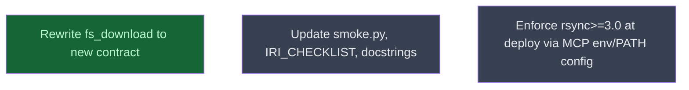

# Productionize fs_download

## Context
<1-2 sentences: where this node fits in the parent campaign, what it depends on, what it produces>

## Goal
<One-line objective for this level>

## Pre-conditions
- [ ] <Measurable entry criteria>

## Success Gates
- ✅ <Measurable completion criteria>

## Status

## Nodes
| Node | Type | Status |
|:-----|:-----|:-------|
| `rewrite_tool.md` | 📄 Leaf Task | ✅ Done |
| `tests_and_docs.md` | 📄 Leaf Task | ⬜ Planned |
| `deploy_rsync_env.md` | 📄 Leaf Task | ⬜ Planned |

## Amendment Log
| ID | Date | Source | Nodes Added | Rationale |
|:---|:-----|:-------|:------------|:----------|

## Progress
| Node | Branch | Commits | Notes |
|:-----|:-------|:--------|:------|
